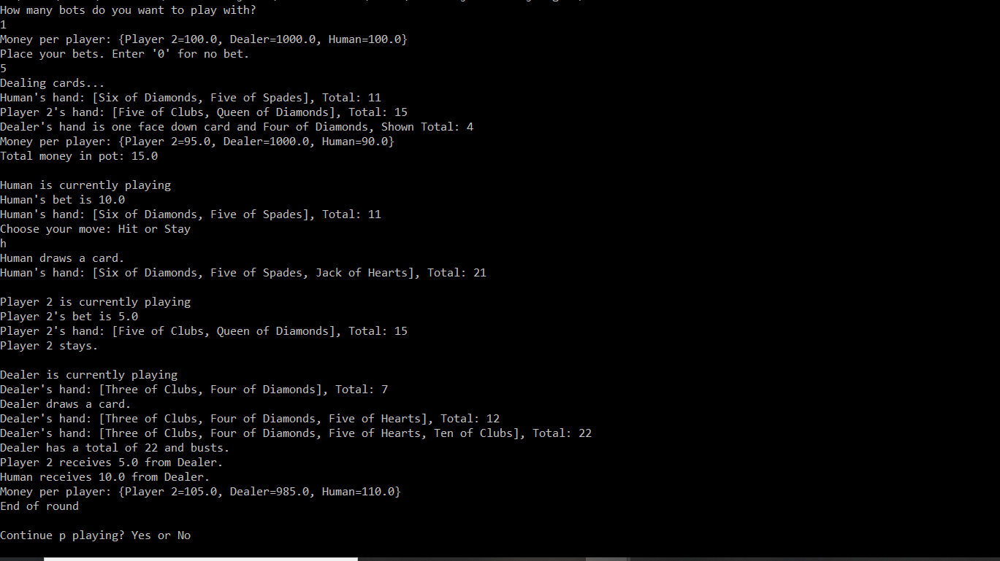

# Blackjack

## Description
Play a text based game of Blackjack (21) against bots.

## Motivation
Players of all skill levels can learn to play, improve, and refine their Blackjack skills.

## Result
This program is written in Java. Classes are modularized across different files. Unit tests ensure game logic is correct. Users interact through the game with a text interface. To play blackjack, just compile and run main.

## Future Improvements
- [ ] Add GUI interface for game
